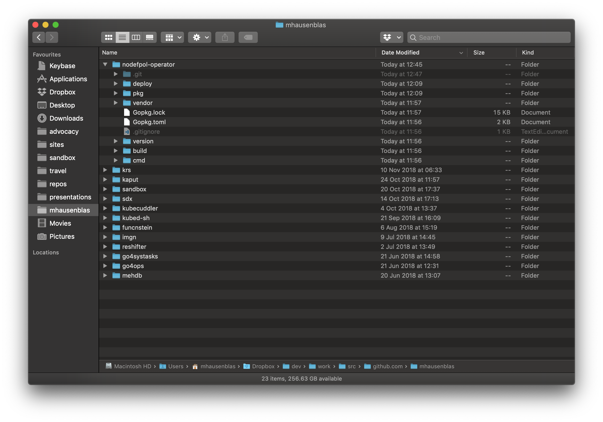
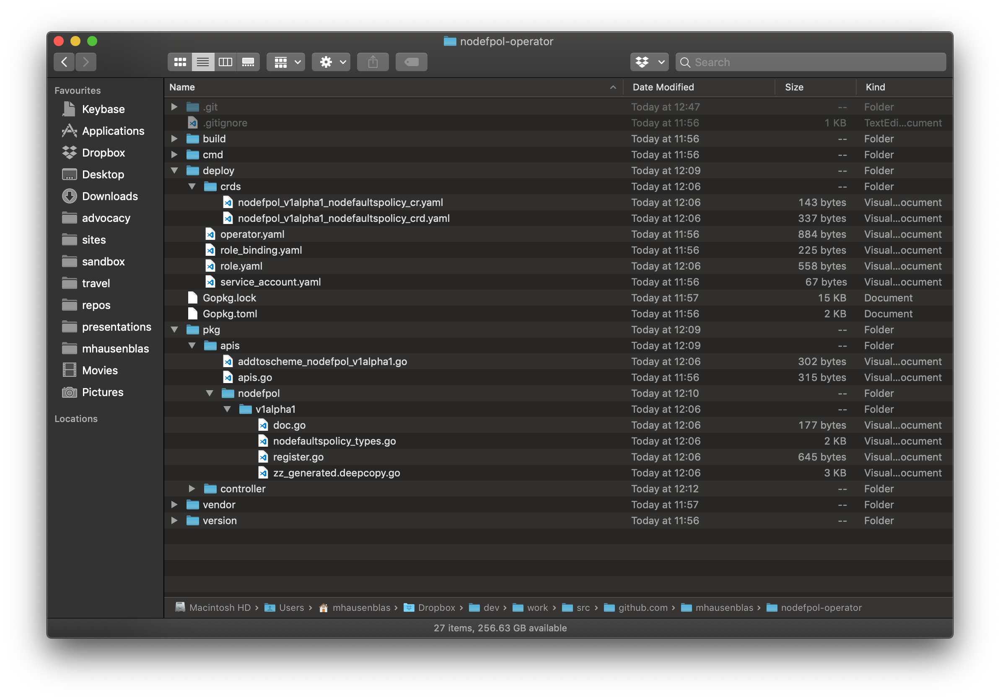
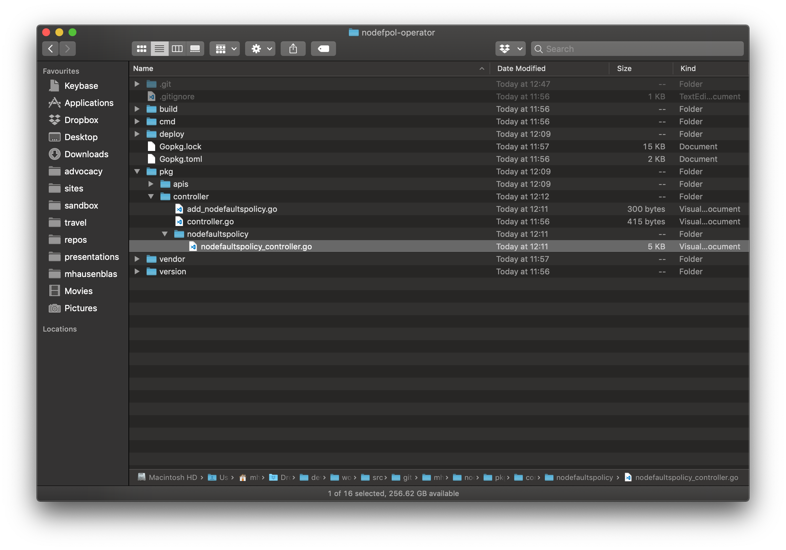
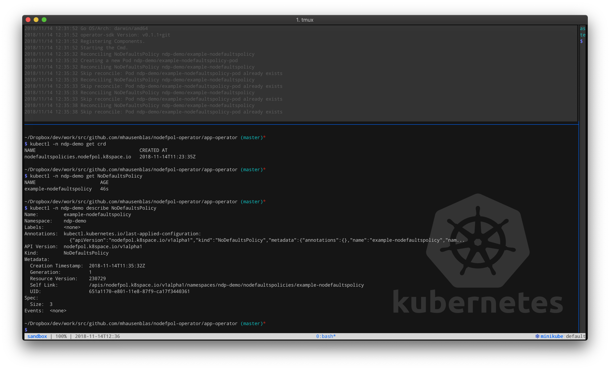
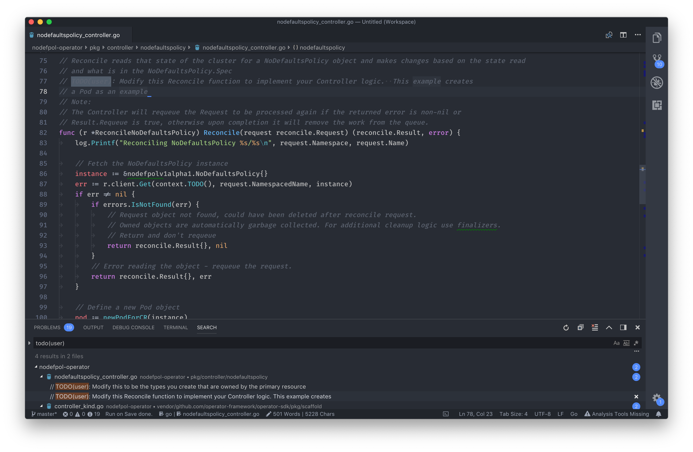

## Bootstrapping a Kubernetes operator

In the following, I'm showing you how to bootstrap a Kubernetes operator using the [Operator SDK](https://github.com/operator-framework/operator-sdk).
The goal is to bootstrap an operator (custom resource and controller) that monitors a namespace for usage of the default service account.
We call this operator the no-defaults-policy operator, and its main task is to flag pods using the default service account (a security anti-pattern).
Strictly speaking, this is not the best use case for an operator since it's not really about the life cycle management of an app: a number of alternative solutions, 
from a simple controller to a shell script using `kubectl` would do the same job. However, since it's conceptually easy to understand what the operator's job is and
the custom resources gives us a nice way to configure the actual behavior, the policy enforcement—for example, annotating the pod or a more extreme measure like deleting its owner, such as a deployment—we do it nevertheless.
Also, others also seem to be fine with applying the operator pattern in such a context, see for example the [rbac-manager/](https://reactiveops.github.io/rbac-manager/).
May the Kube gods have mercy on us.

Table of contents:

- [Setting the scene](#setting-the-scene)
- [Deploying the operator locally](#local-deployment)
- [Deploying the operator into a cluster](#in-cluster-deployment)
- [Development of the custom controller](#development)
- [References](#references)

## Setting the scene

All the business below goes on in a dedicated namespace, we call it `ndp-demo`:

```
$ kubectl create ns ndp-demo
```

STEP 1—As a preparation, [install the Operator SDK](https://github.com/operator-framework/operator-sdk#prerequisites) and then
bootstrap the operator like so:

```
$ cd $GOPATH/src/github.com/mhausenblas
$ operator-sdk new nodefpol-operator
$ cd nodefpol-operator
```

As a result we should see something like this:



See also [terminal output](STEP-1_outputof_new_app-operator.md) of above command.

STEP 2—Next, we add a new API for the custom resource `NoDefaultsPolicy`:

```
$ pwd
/Users/mhausenblas/Dropbox/dev/work/src/github.com/mhausenblas/nodefpol-operator

$ operator-sdk add api --api-version=nodefpol.k8space.io/v1alpha1 --kind=NoDefaultsPolicy
```

As a result we should see something like this:



See also [terminal output](STEP-2_outputof_add_api.md) of above command.

STEP 3—Now we add a new controller that watches for `NoDefaultsPolicy` resources:

```
$ operator-sdk add controller --api-version=nodefpol.k8space.io/v1alpha1 --kind=NoDefaultsPolicy
```

As a result we should see something like this:



See also [terminal output](STEP-3_outputof_add_controller.md) of above command.

## Local deployment

STEP 4—Install the custom resource definition (CRD) and launch the operator locally:

```
$ kubectl -n ndp-demo apply -f deploy/crds/nodefpol_v1alpha1_nodefaultspolicy_crd.yaml
$ OPERATOR_NAME=nodefpol-operator operator-sdk up local --namespace "ndp-demo"
```

As a result we should see something like this:



See also [terminal output](STEP-4_outputof_operator-sdk-up.md) of above command.

Now it's time to create a `NoDefaultsPolicy` custom resource. Also, note that the default controller will watch for `NoDefaultsPolicy` objects for each custom resource we create:

```
$ kubectl -n ndp-demo apply -f deploy/crds/nodefpol_v1alpha1_nodefaultspolicy_cr.yaml
```

## In-cluster deployment

In order to deploy the operator into the cluster, we first build a container image and push it to a registry,
and then create the necessary resources such as a service account, RBAC roles & bindings, the CRD itself, and a custom resource instance, 
and deploy the operator.

STEP 5—Starting off by building a container image and pushing it to a public registry (note: make sure you're logged into registry, in my case Quay.io, first):

```
$ operator-sdk build quay.io/mhausenblas/nodefpol
$ docker push quay.io/mhausenblas/nodefpol
```

Make sure to update the operator manifest to use the built image name (`quay.io/mhausenblas/nodefpol` in my case):

```
$ sed -i "" 's|REPLACE_IMAGE|quay.io/mhausenblas/nodefpol|g' deploy/operator.yaml
```

STEP 6—First, we set up a dedicated service account as well as the respective RBAC roles and bindings:

```
$ kubectl -n ndp-demo apply -f deploy/service_account.yaml
$ kubectl -n ndp-demo apply -f deploy/role.yaml
$ kubectl -n ndp-demo apply -f deploy/role_binding.yaml
```

STEP 7—We install the custom resource definition (CRD), if not already done for local deployment:

```
$ kubectl -n ndp-demo apply -f deploy/crds/nodefpol_v1alpha1_nodefaultspolicy_crd.yaml
```

STEP 8—Time to deploy the operator:

```
$ kubectl -n ndp-demo apply -f deploy/operator.yaml
```

STEP 9—Now we create a `NoDefaultsPolicy` custom resource, if not already done for local deployment:

```
$ kubectl -n ndp-demo apply -f deploy/crds/nodefpol_v1alpha1_nodefaultspolicy_cr.yaml
```

To clean up, getting rid of all the resources including the custom resources and CRD we installed, do:

```
$ kubectl delete ns ndp-demo
```

## Development

The Operator SDK creates a ton of boot-strapping code and config, however, now your work starts. 
To start this process, find `//TODO(user)` annotations in the Go source code and start implementing your custom logic. 
For example, in my VS Code environment, it looks something like this:



## References

To learn more on the topic, check out the following references:

- [CLI reference](https://github.com/operator-framework/operator-sdk/blob/master/doc/sdk-cli-reference.md)
- [User Guide](https://github.com/operator-framework/operator-sdk/blob/master/doc/user-guide.md)
- [Building an operator for Kubernetes with operator-sdk](https://itnext.io/building-an-operator-for-kubernetes-with-operator-sdk-40a029ea056)
- [A complete guide to Kubernetes Operator SDK](https://banzaicloud.com/blog/operator-sdk/)
- [Make a Kubernetes Operator in 15 minutes with Helm](https://blog.openshift.com/make-a-kubernetes-operator-in-15-minutes-with-helm/)
- [Operator Lifecycle Manager](https://itnext.io/wth-is-a-operator-lifecycle-manager-873cf1661b04) 
- [Building an Kubernetes Operator for Prometheus and Thanos](https://robszumski.com/building-an-operator/)
